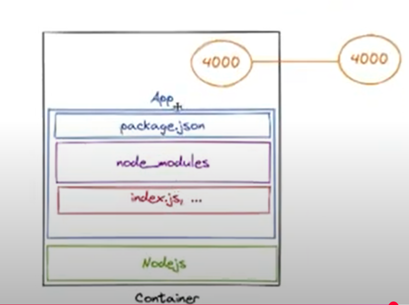

# Note:

## 1 <a href="https://www.youtube.com/watch?v=og6jyK1U4rw&list=PLzNfs-3kBUJnY7Cy1XovLaAkgfjim05RR&index=5"> Dockerfile </a>

```
# Base image with latest Node.js 20
FROM node:20

# Set the working directory inside the container
WORKDIR /app

# Copy only package.json (and optionally package-lock.json) first
# This helps leverage Docker layer caching for faster builds
COPY package*.json ./

# Install all dependencies
RUN npm install

# Copy the rest of the application source code
COPY . .

# Expose the port your app runs on (for Doc)
EXPOSE 4000

# Command to run the application
CMD ["npm", "start"]
```


## 2 <a href="https://www.youtube.com/watch?v=brdr_88m20k&list=PLzNfs-3kBUJnY7Cy1XovLaAkgfjim05RR&index=5">Images & Containers</a>


## 3 <a href="https://www.youtube.com/watch?v=UDqNwH4VpOU&list=PLzNfs-3kBUJnY7Cy1XovLaAkgfjim05RR&index=6">Docker Optimization </a> 
- Use a `.dockerignore` file to exclude directories or files that shouldn't be included in the Docker image (e.g., node_modules, logs, etc.).

- Copy only the `package.json` and package-lock.json (if available) before copying the rest of the code. This ensures that npm install is only re-run when dependencies change, not every time the application code is updated.

- 🔍 So... is Docker smart enough to know that it’s npm install?
Nope — not exactly.

Docker itself doesn’t actually understand what npm install is or does. It’s not inspecting the command and going:

"Oh hey! That's npm install, so I’ll only run it if package.json changes."

Instead, Docker just tracks file changes between layers. It doesn't interpret commands — it treats them like black boxes. What it does is this:

🚦 Docker's logic is:
"If the files involved in a COPY or ADD command haven’t changed since last build, then reuse the cached layer — including any commands (RUN, etc.) that came after."

- `docker exec -it node-app-container bash` -> Hey Docker, I want to go inside the running container called node-app-container and use the terminal (just like I do on my local computer).

## 4 <a href="https://www.youtube.com/watch?v=iT5OjRX9UkM&list=PLzNfs-3kBUJnY7Cy1XovLaAkgfjim05RR&index=7">Docker Hot Reload</a>

* `docker logs node-app-container` This command lets you **see the logs** of a running container — great for checking if your app is working or debugging issues.

* `docker run --name node-app-container -v "relative-path-on-machine:/app" -d -p 4000:4000 node-app` This runs a container and **binds a volume** between your machine and the container. It allows for **live syncing of files**:
   * If you change a file on your machine → it reflects inside the container.
   * If you change a file inside the container → it reflects back on your machine.

## Volume Binding Details

🔄 This sync **overwrites** what you built into the image, even if you added files to `.dockerignore`. So the entire folder on your machine replaces the contents at `/app` inside the container.

## Common Nodemon Issues

### 🧠 Why nodemon might not restart on code changes

If you're on **Windows**, especially using drives like `D:\`, you might notice:
You change a file locally, but **nodemon doesn't detect it** and doesn't restart the server.

This happens because:
* Docker Desktop on Windows runs Linux containers inside a **virtual machine**.
* Your project folder (on Windows NTFS) is shared with the Linux VM through a mounted volume.
* **File system events** (like file changes) sometimes **don't trigger properly** across this bridge.

So while `nodemon` is watching the files, it's not seeing the changes because the **file change events get lost** in translation.

### ✅ How to fix it

Create a `nodemon.json` file in the root of your project with this content:

```json
{ 
  "watch": ["."], 
  "ext": "js,json", 
  "legacyWatch": true, 
  "delay": "200" 
}
```

This tells `nodemon` to **use polling** instead of relying on OS-level file events. It's a bit less efficient, but it works reliably across Docker + Windows setups.
